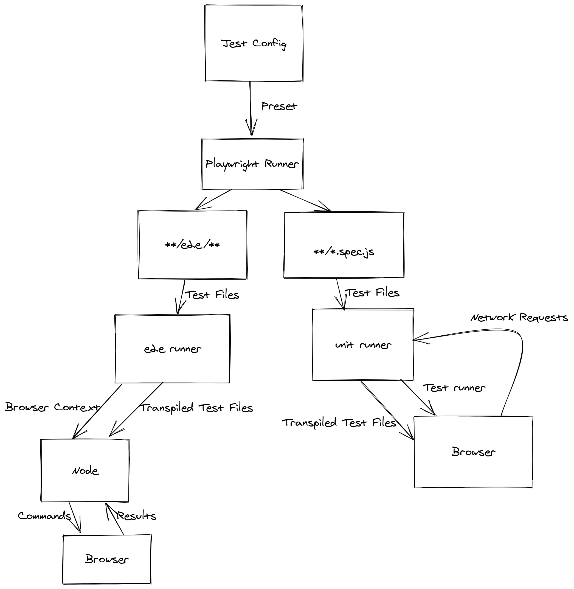

## About
To provide the best web testing experience, we need to write our own web test runner. To make the test runner, we use the [jest platform](https://www.youtube.com/watch?v=NtjyeojAOBs).

The runner comes in two flavors:

- **jest-runner-playwright-e2e** Tests run in node, and control one or more web pages. Code coverage and other metadata is taken from the browser, rather than node. One node process is used to connect to mulitple parallel browser processes.

- **jest-runner-playwright-unit** Tests run in the browser. Code is transformed from node-style to web-style on the fly. This is a mostly drop-in replacement for JSDOM. Perliminary tests show this to be faster to startup and faster to run than JSDOM code!

